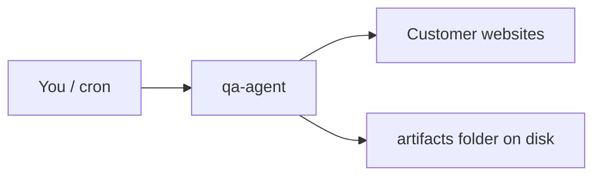

# How QA-Agent is put together

This page is a **simple picture** of what runs when you use the tool. For commands, see the **[main README](../README.md)**.

---

## Big picture

You run a **CLI** (command-line program) on a computer you control. It talks to **websites over HTTPS**. It saves **files on disk** (reports). It does **not** need to be “hosted” as a website for the basic flow.

---

## Main path: `health`

For each **starting URL** in your text file:

1. **Load the page** with Node’s built-in `fetch`.
2. **Parse HTML** with **Cheerio** (like jQuery for server-side) and find `<a href="...">` links.
3. **Stay on the same website** (same “origin” — same protocol + host + port).
4. **Queue new links** and keep going (**breadth-first**). By default **`--max-pages` is 0** (no cap): the crawl continues until the queue is empty or something stops the process.
5. **Check links** that weren’t fully opened with **HEAD** requests. By default **`--max-link-checks` is 0** (no cap). If **`--max-pages`** is capped, some internal URLs may only be **HEAD**-checked here; with a **full** BFS (no cap), this pass often has little or nothing left to do.
6. **Write** `report.html` / `report.json` per site, plus a run-level `index.html` and `summary.txt`.

Report fields **`pagesVisited`** vs **`uniqueUrlsChecked`**: the first is full **GET** fetches; the second adds **HEAD** (or similar) checks for discovered URLs not covered by the BFS when a **page cap** was in effect.

**Health** is **crawl + link checks** — HTTP status and discovered internal URLs. No third-party scoring APIs.

---

## Optional: `--serve` dashboard

If you add `--serve`, a **small web server** starts on **your computer** (usually `127.0.0.1`). It shows **live progress** using **Server-Sent Events** (the server pushes updates to the browser). After the run, it can **serve the report files** so links work in the browser. It’s meant for **operators**, not the public internet.

---

## Legacy path: `run`

This one is **different**:

- Reads a **JSON config** (e.g. **`config/sites.json`**, copied from `sites.example.json` — not the simple `.txt` list used by `health`).
- Opens **Playwright** (Chromium) like a real user.
- Used for **form / smoke tests**, not the default “health crawl.”

---

## Main files (where the logic lives)

| File / folder | Role |
|---------------|------|
| `src/index.ts` | Parses command-line arguments; starts `health` or `run`. |
| `src/health/crawl-site.ts` | The **crawler**: `fetch` + Cheerio, BFS, link checks. |
| `src/health/report-site.ts` | Builds HTML/JSON reports. |
| `src/health/orchestrate-health.ts` | Runs many sites in parallel, creates run folders. |
| `src/health/health-dashboard-server.ts` | Optional local dashboard + SSE. |
| `src/orchestrate.ts` + `src/runner/` | Legacy Playwright runs. |

---

## What we do **not** do here

- **No** `robots.txt` enforcement in code (get permission before crawling hard).
- **No** multi-tenant hosted product — you run the binary yourself.
- **No** full-page screenshot or visual “does it look right?” testing in `health`.

---

## Configuration layout

| In git | Local only (gitignored) |
|--------|-------------------------|
| `config/urls.example.txt` | `config/urls.txt` — one root URL per line for **`health`** |
| `config/sites.example.json` | `config/sites.json` — Playwright **`run`** targets |

Operators **`cp`** from the examples and customize. **`artifacts/health/`** outputs are also ignored except a placeholder **`.gitkeep`**.

---

*Kept short on purpose. See [PRD](./PRD.md) for goals and non-goals.*
